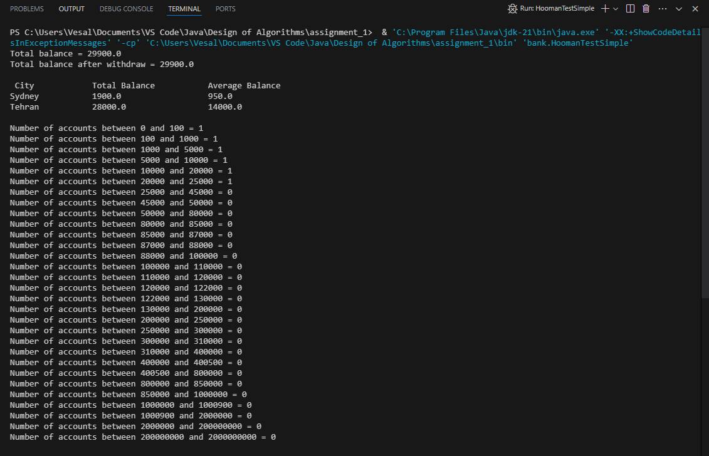
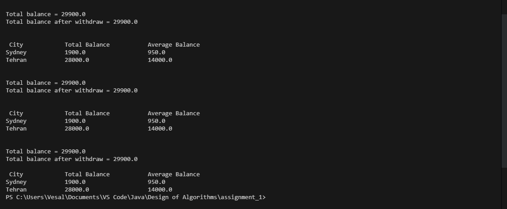
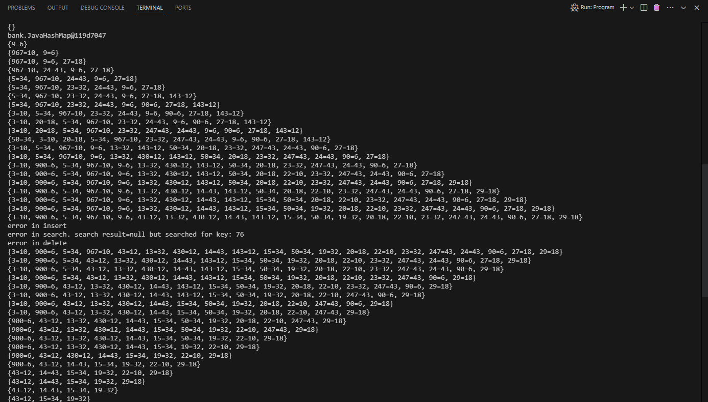

# Assignment 1
In this assignment, we explored key concepts from the Design of Algorithms course to solve specific programming challenges.

## Team Members
- **Vesal Bargi**
- **Noura Kelidi**

## Screenshots of Output
Below are screenshots showcasing the output of our algorithms:

### HoomanTestSimple Output

### Program Output

