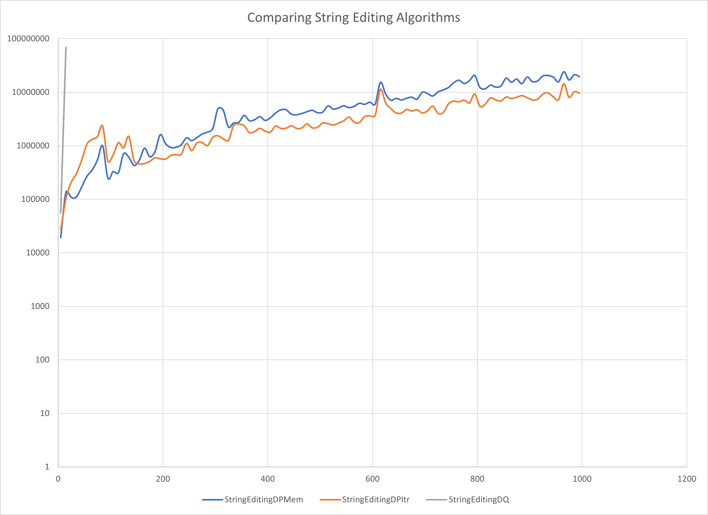
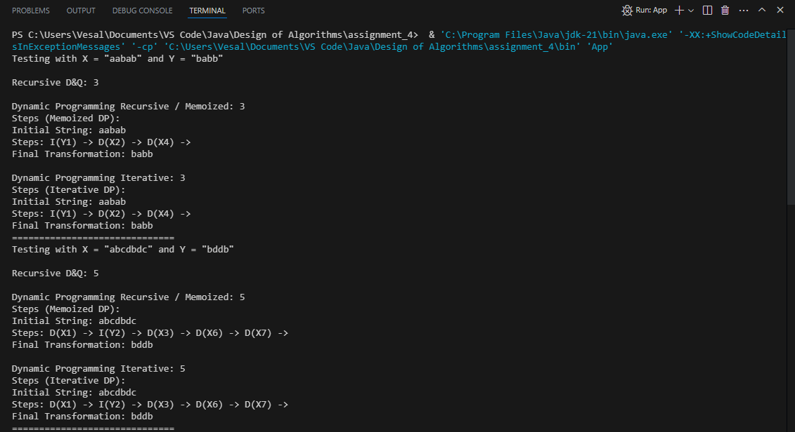
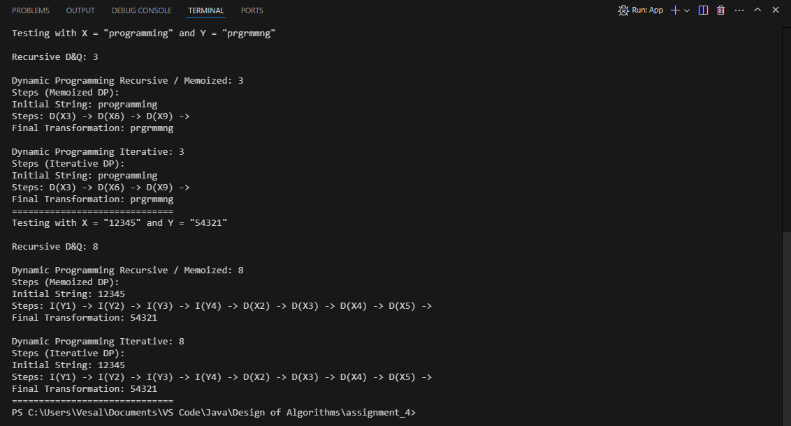
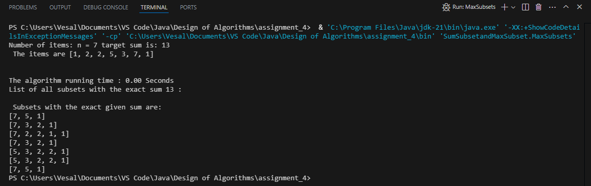

# Assignment 4
In this assignment, we explored key concepts from the Design of Algorithms course to solve specific programming challenges.

## Team Members
- **Vesal Bargi**

## Screenshots of Output
Below are screenshots showcasing the output of our algorithms:

### String Editing Excel Output

### App Output

### MaxSubsets Output
