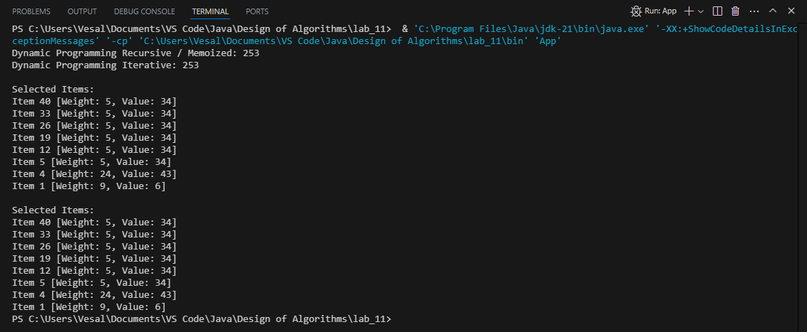
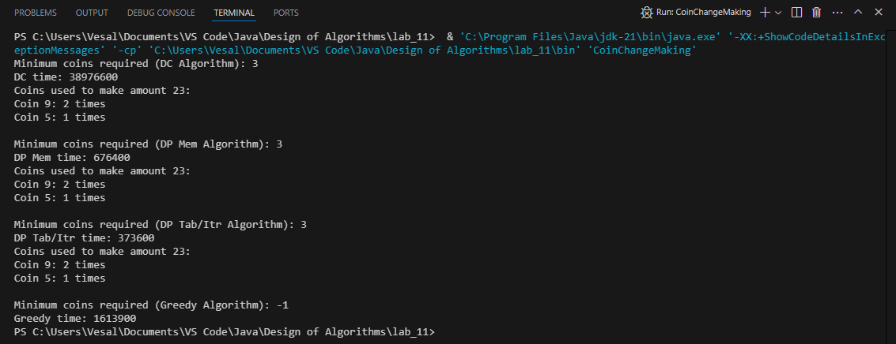
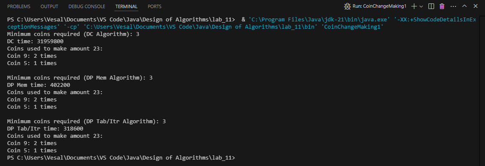

# Lab 11
In this lab, we explored key concepts from the Design of Algorithms course to solve specific programming challenges.

## Team Members
- **Vesal Bargi**

## Screenshots of Output
Below are screenshots showcasing the output of our algorithms:

### Knapsack Output

### CoinChangeMaking Output

### CoinChangeMaking1 Output
