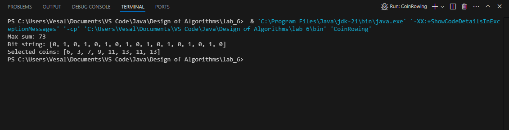
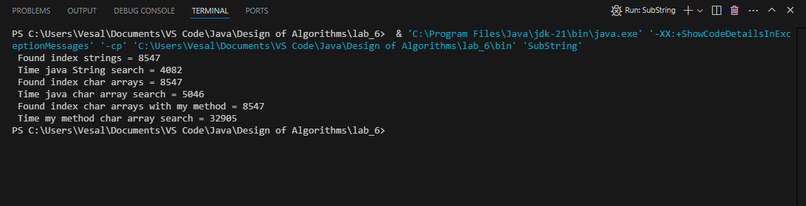

# Lab 6
In this lab, we explored key concepts from the Design of Algorithms course to solve specific programming challenges.

## Team Members
- **Vesal Bargi**
- **Mohammad Kholghi**

## Screenshots of Output
Below are screenshots showcasing the output of our algorithms:

### CoinRowing Output

### SubString Output

