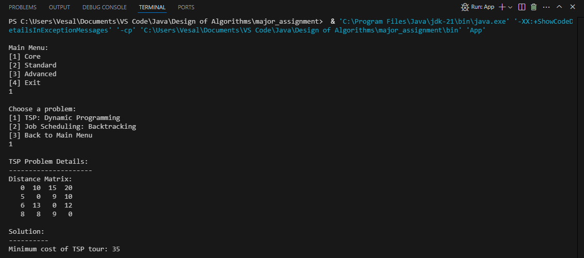
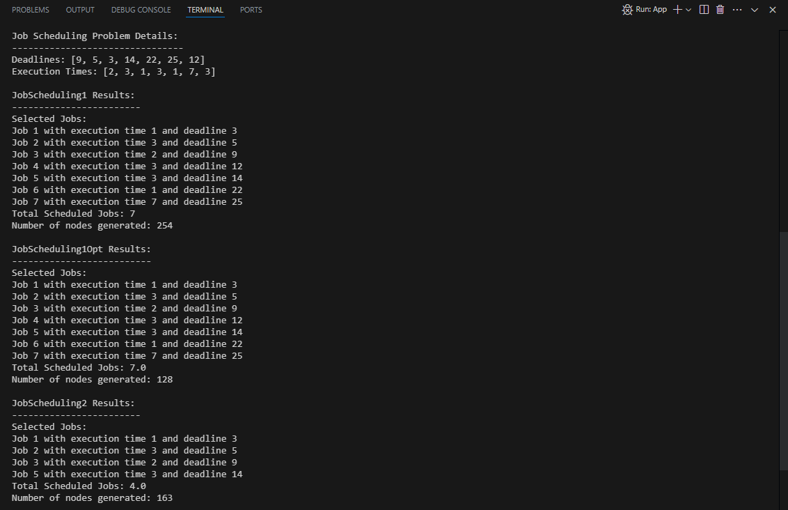
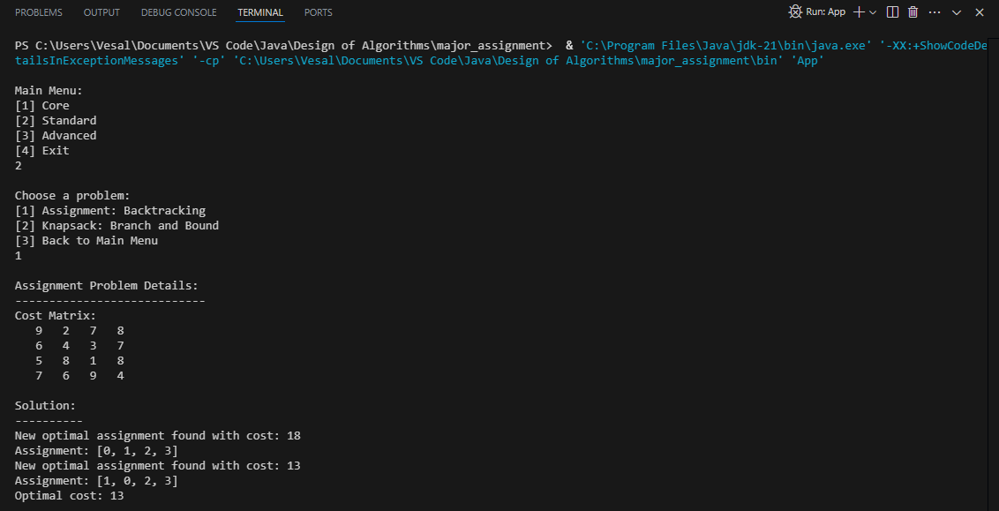
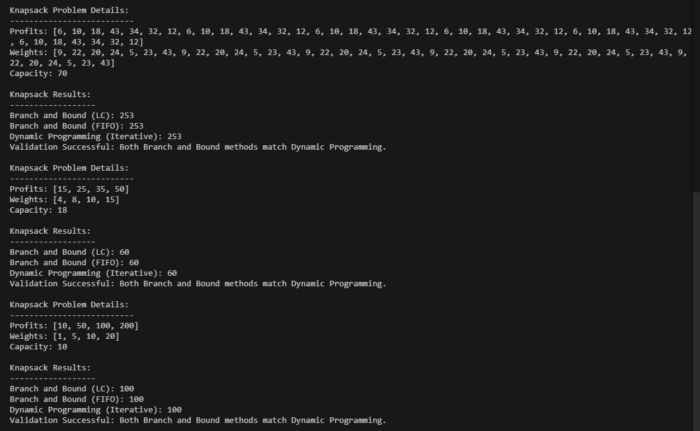
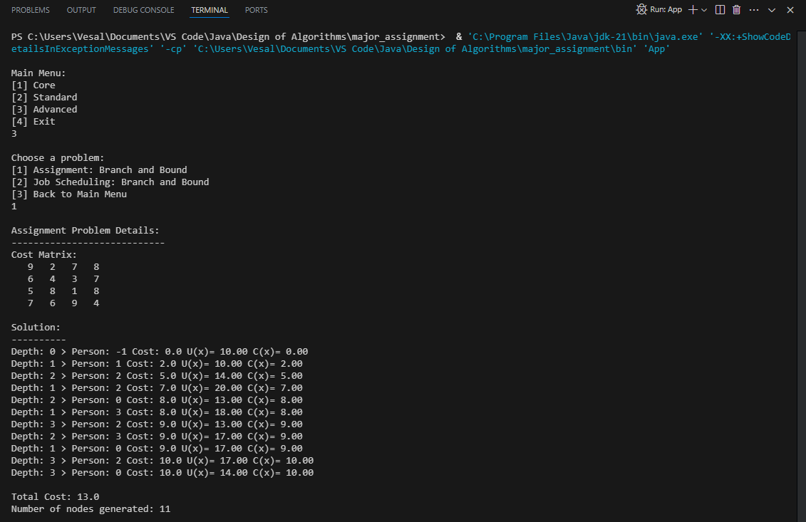
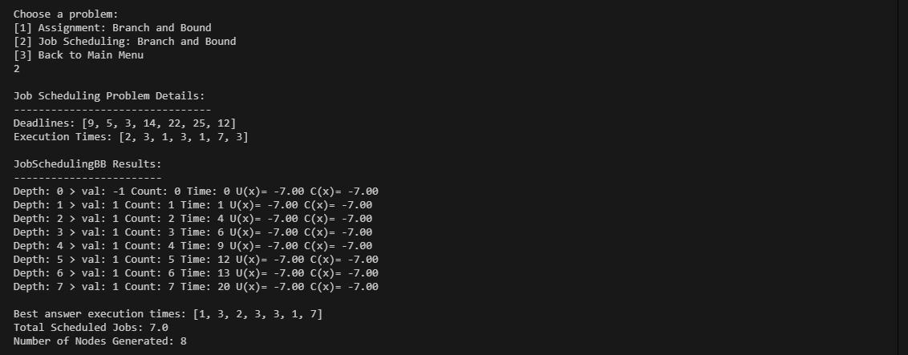

# Major Assignment
In this assignment, we explored key concepts from the Design of Algorithms course to solve specific programming challenges.

## Team Members
- **Vesal Bargi**
- **Noora Laghaee**
- **Alast Abolfazli**

## Screenshots of Output
Below are screenshots showcasing the output of our algorithms:

### TSP Dynamic Programming Output

### Job Scheduling Backtracking Output

### Assignment Backtracking Output

### Knapsack Branch and Bound Output

### Assignment Branch and Bound Output

### Job Scheduling Branch and Bound Output
